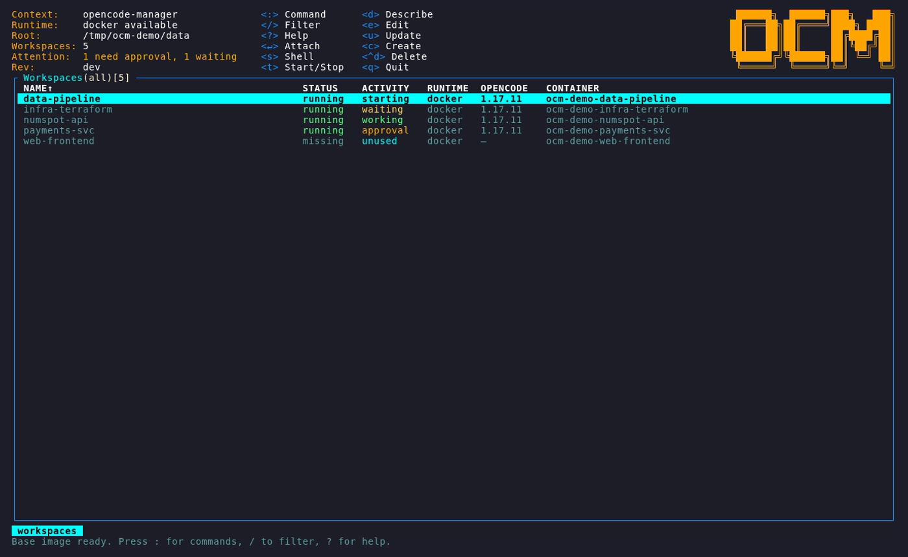
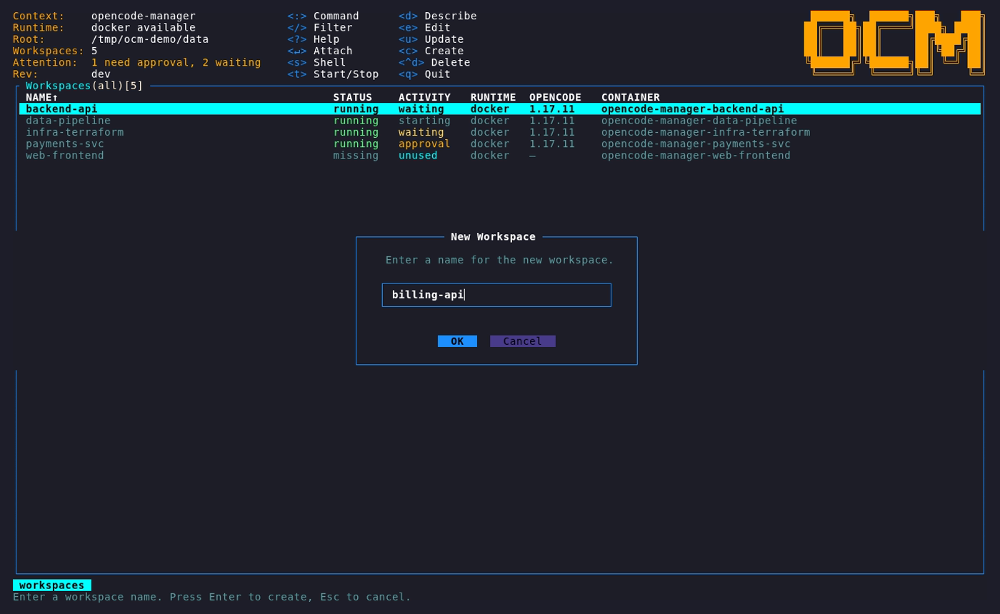
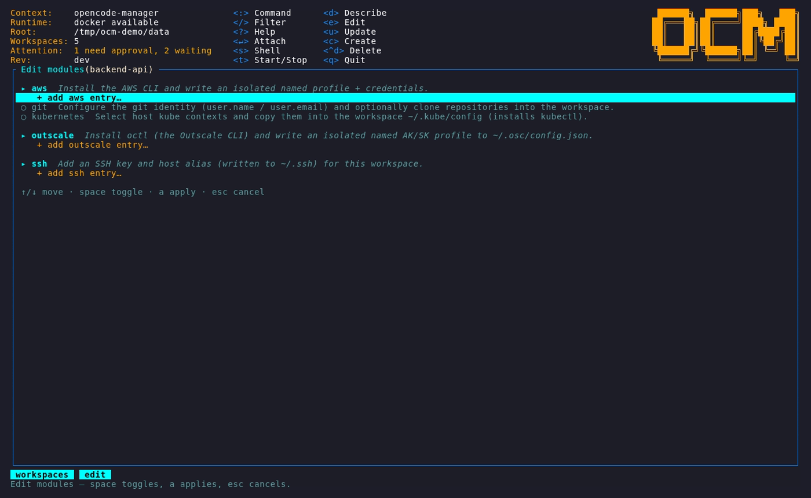
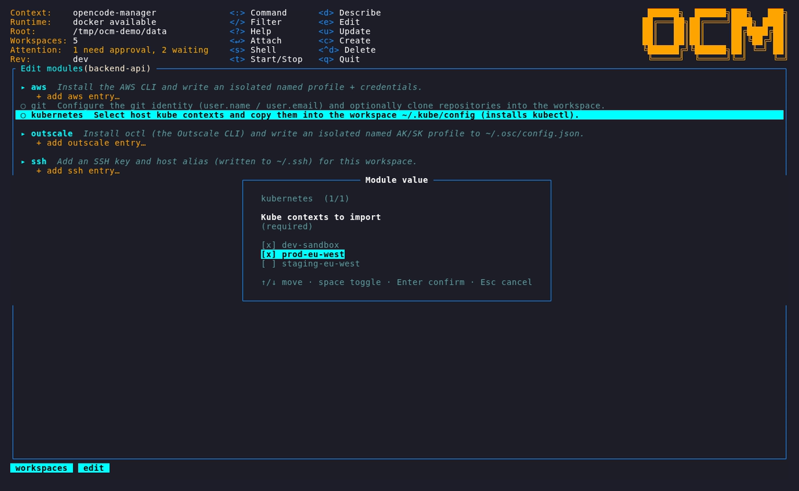
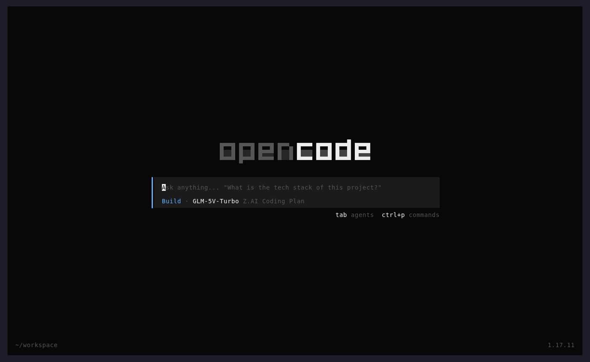

# Getting Started

This walkthrough takes you from a fresh install to coding inside an isolated
workspace.

## 1. Install

See [Installation](installation.md). In short:

```sh
npm install -g @mickaelroger78/opencode-manager
```

## 2. Add your OpenCode config

Every workspace shares the OpenCode configuration in your global config
directory. Copy your existing setup into it so all workspaces inherit it:

```sh
cd ~/.config/opencode-manager

cp /path/to/your/opencode.json .
cp -r /path/to/your/skills/*   skills/
cp -r /path/to/your/commands/* commands/
cp -r /path/to/your/agents/*   agents/
cp -r /path/to/your/plugins/*  plugins/
# optional shared instructions:
cp /path/to/your/AGENTS.md     .
```

These are **mounted read-only** into every workspace, so editing them on the
host updates all workspaces live. `ocm` creates this directory and an empty
`opencode.json` on first run, so the layout already exists.

See [Concepts → Shared OpenCode config](concepts.md#shared-opencode-config) for
exactly what is shared and how.

## 3. Launch the dashboard

```sh
ocm
```

On first run the base image is pulled or built. When it is ready you land on the
**workspaces** page.



## 4. Create a workspace

Press `c` (or type `:create`). Name the workspace; if you already have
[templates](templates.md), you'll get an optional **Pick Template** step.



## 5. Add the modules it needs

Select the new workspace and press `e` to edit its modules. Add only what this
project requires — for example AWS, Git, Kubernetes, or SSH — so the agent gets
exactly that project's credentials and nothing else.



Multi-instance modules can import accounts already configured on your host:



See [Modules](modules.md) for what each built-in module does.

## 6. Attach and start coding

Press `Enter` on the workspace to drop straight into its OpenCode TUI, running
inside the isolated container.



Clone whatever repositories you need inside the workspace home directory and work
as usual. When you're done, detach and the container keeps running until you stop
(`t`) or delete (`^d`) it.

## Next steps

- Learn every key and column in the [TUI Guide](tui.md).
- Capture a reusable module set as a [Template](templates.md).
- Tune the runtime and base image in [Configuration](configuration.md).
