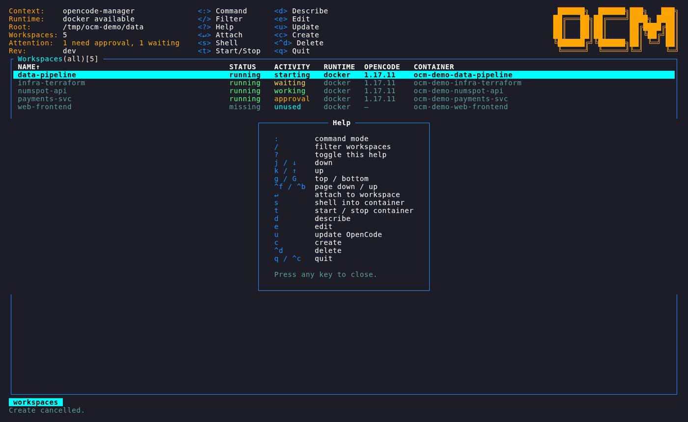
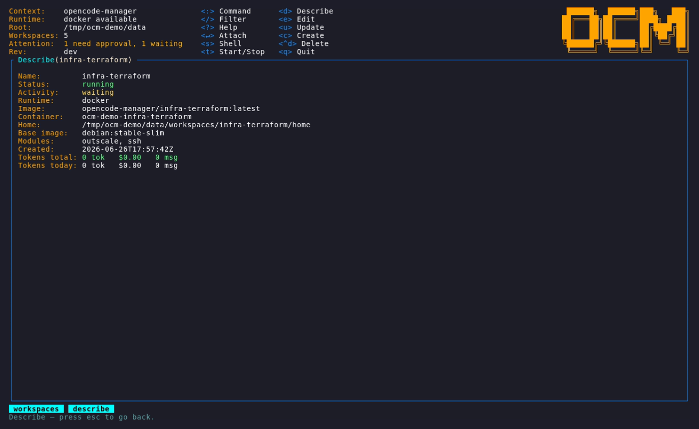
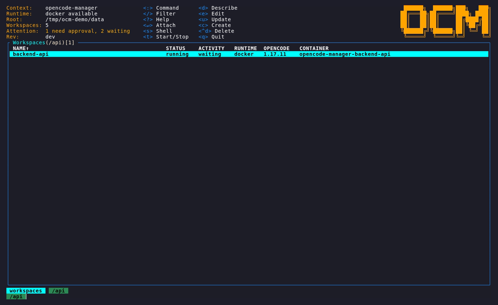

# TUI Guide

`ocm` with no arguments launches a keyboard-driven dashboard modelled on
[k9s](https://k9scli.io/). This page documents every page, key, and column.

Launch it with:

```sh
ocm
```

## Pages and the `:` prompt

`:` opens a command prompt used **only to switch views** (k9s-style), not as a
general command line. The available views (*kinds*) are:

| Type | Aliases | Page |
| --- | --- | --- |
| `:workspaces` | `workspace`, `ws` | The main workspace dashboard. |
| `:templates` | `template`, `tmpl` | Manage reusable [templates](templates.md). |


## Keyboard reference (workspaces page)

| Key | Action |
| --- | --- |
| `:` | Switch view (`:workspaces`, `:templates`) |
| `/` | Filter the list |
| `?` | Toggle the help overlay |
| `j` / `↓` | Move down |
| `k` / `↑` | Move up |
| `g` / `G` | Jump to top / bottom |
| `^f` / `^b` | Page down / page up |
| `↵` (Enter) | **Attach** to the selected workspace's OpenCode session |
| `s` | Open a **shell** in the workspace container |
| `t` | **Start / stop** the container (toggle) |
| `d` | **Describe** the workspace (details + token breakdown) |
| `e` | **Edit** the workspace's modules |
| `u` | **Update** OpenCode in the workspace |
| `c` | **Create** a workspace |
| `^d` | **Delete** the workspace |
| `q` / `^c` | Quit |



### Attach (`Enter`)

Drops you straight into the selected workspace's OpenCode TUI, running inside the
isolated container. Detaching returns you to the dashboard; the container keeps
running.

### Shell (`s`)

Opens an interactive shell inside the workspace container as the workspace user
(passwordless `sudo` is available). Useful for cloning repos, inspecting state,
or debugging a module.

### Describe (`d`)

Shows workspace details — status, start time, image, installed modules — and the
full token breakdown (input / output / cache-read).



### Edit modules (`e`)

Opens the module editor for the selected workspace. Modules are shown as a
**category browser** (a category header with its modules indented beneath), and
`/` filters by name, description, or category. See
[Modules](modules.md) for what you can add.


Multi-instance modules show an import picker listing the matching accounts found
on your host (AWS/Outscale profiles, SSH host aliases, Kubernetes contexts),
plus an **Add manually…** option:


### Create (`c`)

Opens the **New Workspace** dialog. Type a name; if you have templates, a
**Template (optional)** selector appears under the name — press `Tab` to focus it
and `←`/`→` to choose a template (or *None*). Choosing a template starts the
workspace with its modules pre-installed. `Tab`/`Shift+Tab` (or `↑`/`↓`) move
between the name, selector, and the OK/Cancel buttons; `Enter` creates, `Esc`
cancels.

## Filtering

Press `/` on any list to filter it. On the workspace list it matches workspace
names; in the module editor it matches module name, description, or category.



## The TOKENS column

The dashboard table includes a **TOKENS I/O/C** column showing each workspace's
all-time input / output / cache-read token usage, compacted as `k`/`M`/`B`
(e.g. `12.3k/4.5k/89k`). It is measured with
[tokscale](https://www.npmjs.com/package/tokscale) inside the container,
refreshed when a workspace starts and each time it finishes a turn. The full
breakdown is on the describe page (`d`).

## Templates page

Reach it with `:templates`. It reuses the workspace module editor:

| Key | Action |
| --- | --- |
| `c` | Create a template (name it, then pick its modules) |
| `e` / `↵` | Edit a template |
| `^d` | Delete a template |
| `:workspaces` | Return to the workspace dashboard |

See [Templates](templates.md) for the full workflow.

## Statuses

Workspaces report a lifecycle status in the dashboard (for example *creating*,
*working*, *waiting*, *sleeping*, *restarting*, *paused*, *removing*, *dead*).
A workspace that is waiting for interaction is surfaced on the central dashboard
so you can jump straight to it.
