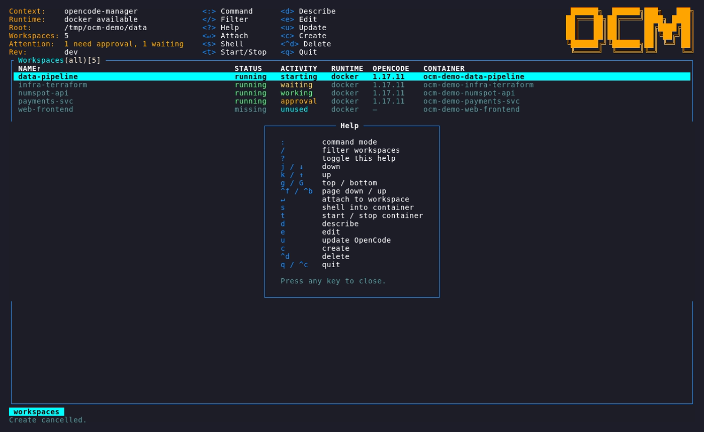
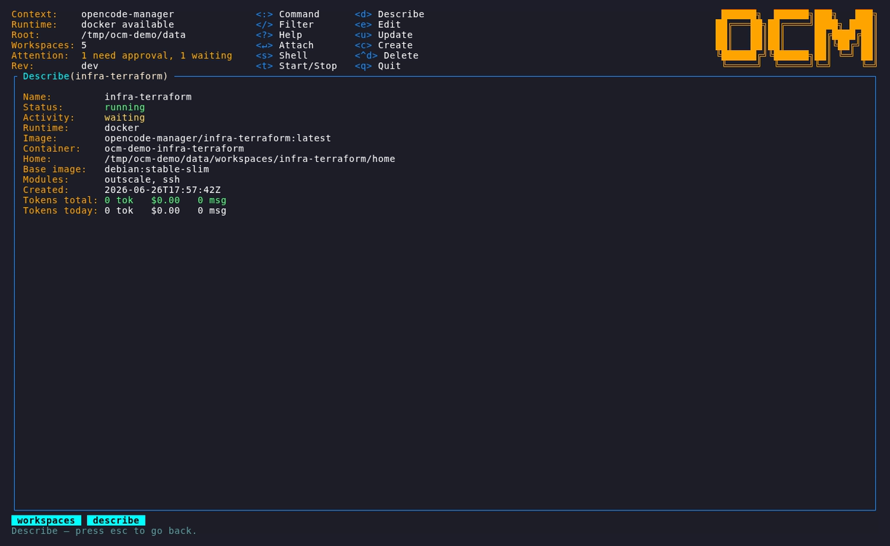
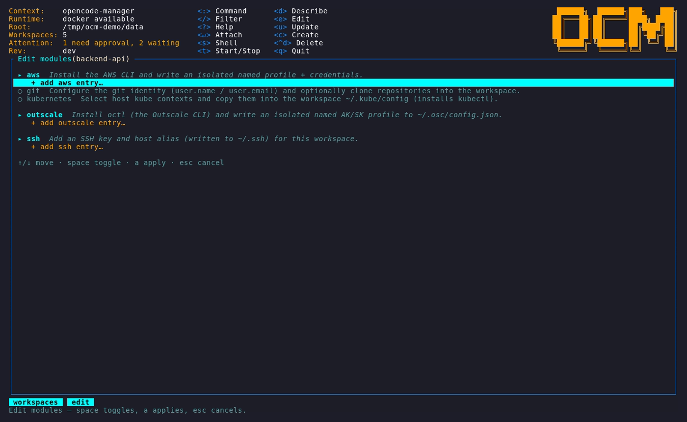
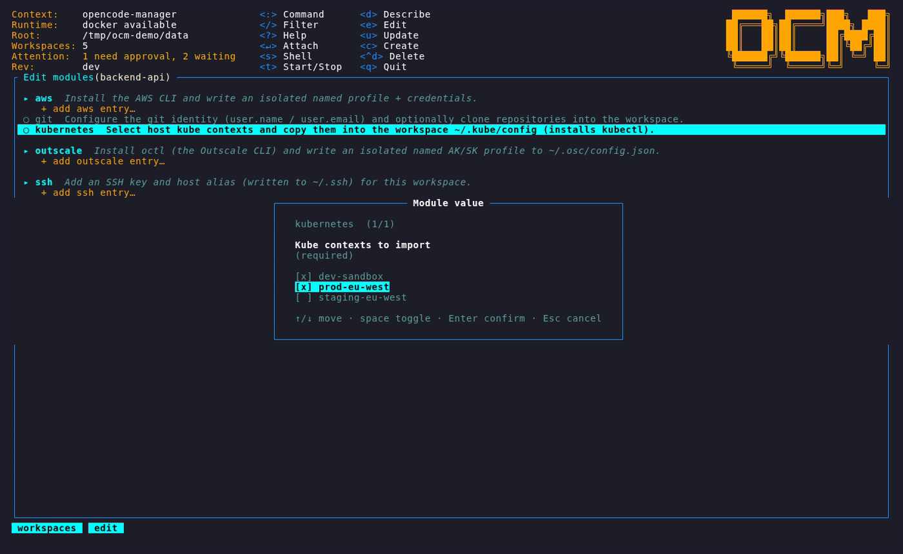
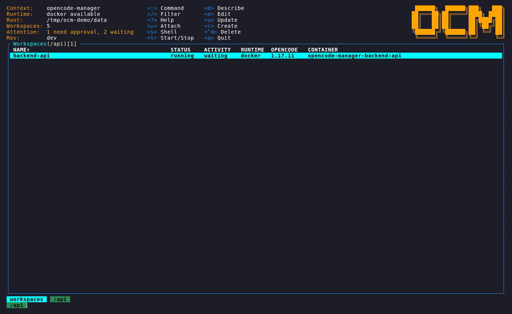

# TUI Guide

`ocm` with no arguments launches a keyboard-driven dashboard modelled on
[k9s](https://k9scli.io/). This page documents every page, key, and column.

Launch it with:

```sh
ocm
```

## Pages and the `:` prompt

`:` opens a command prompt used **only to switch views** (k9s-style), not as a
general command line. The available views (*kinds*) are:

| Type | Aliases | Page |
| --- | --- | --- |
| `:workspaces` | `workspace`, `ws` | The main workspace dashboard. |
| `:templates` | `template`, `tmpl` | Manage reusable [templates](templates.md). |


## Keyboard reference (workspaces page)

| Key | Action |
| --- | --- |
| `:` | Switch view (`:workspaces`, `:templates`) |
| `/` | Filter the list |
| `?` | Toggle the help overlay |
| `j` / `↓` | Move down |
| `k` / `↑` | Move up |
| `g` / `G` | Jump to top / bottom |
| `^f` / `^b` | Page down / page up |
| `↵` (Enter) | **Attach** to the selected workspace's default agent runtime |
| `^o` (Ctrl+O) | Open the **runtime picker**, then attach with the chosen harness |
| `s` | Open a **shell** in the workspace container |
| `t` | **Start / stop** the container (toggle) |
| `d` | **Describe** the workspace (details + token breakdown) |
| `l` | View the latest OpenCode session's input/output transcript |
| `e` | **Edit** the workspace's modules |
| `u` | **Update** OpenCode in the workspace |
| `c` | **Create** a workspace |
| `^d` | **Delete** the workspace |
| `q` / `^c` | Quit |



### Attach (`Enter`)

Drops you into the selected workspace's default runtime. OpenCode is the default
for existing and newly created workspaces. A DeepSeek Harness workspace opens its
dedicated `dsh-tui` client and resumes its most recent session for the workspace.

`Ctrl+O` opens a runtime picker listing the workspace's enabled runtimes (the
default preselected); pick one with `↑`/`↓` and attach with `Enter`. New harnesses
added to the manager appear there automatically.

#### Inside `dsh-tui`

A DeepSeek attach opens the embedded `dsh-tui` client on the workspace's most
recent DSH session. Beyond the composer, session picker (`Ctrl+L`), model
picker (`Ctrl+M`), and `@` file references, it provides:

- **Dynamic slash commands** — every command DSH advertises for the session,
  including plugin commands such as `/agent-teams`, `/compact`, or `/plan`,
  appears in `/` completion and the `Ctrl+P` palette with its description and
  input hint, and runs on the host. TUI-local commands (`/model`, `/sessions`,
  `/new`, `/continue`, `/help`, `/quit`) take precedence on name collisions.
- **Context meter** — the sidebar shows `used / context-window tokens (percent)`
  with the same bounded calculation as DSH Web, updated live through compaction
  and model switches. Until the host reports both usage and capacity, the plain
  token count is shown.
- **MCP section** — when DSH's MCP client plugin is loaded, the sidebar lists
  each configured server with a colored activation dot (green active, amber
  starting/stopping, red failed, gray disabled). The section is hidden when no
  MCP plugin is configured.
- **AgentTeams DAG** — when the [`dsh-agent-teams`](https://github.com/NanmiCoder/dsh-agent-teams)
  plugin is installed, `Ctrl+X T` or `/agent-teams-dag` overlays the team's task
  graph: tasks layered by dependencies with state markers, assignees, and
  dependency trails, plus member progress. `Enter` refreshes the view. Both the
  shortcut and the command exist only when the plugin is detected.

### Shell (`s`)

Opens an interactive shell inside the workspace container as the workspace user
(passwordless `sudo` is available). Useful for cloning repos, inspecting state,
or debugging a module.

### Describe (`d`)

Shows workspace details — status, start time, image, installed modules — and the
full token breakdown (input / output / cache-read).



### Logs (`l`)

Shows the selected running workspace's latest OpenCode session without attaching
the OpenCode TUI. The transcript updates live from the OpenCode server event
stream and includes OpenCode text, reasoning, tool output, and todo updates.
Press `s` to toggle auto-scroll, use `↑`/`↓` and `^f`/`^b` to scroll, and press
`Esc` to return to the dashboard.

### Edit modules (`e`)

Opens the module editor for the selected workspace. Modules are shown as a
**category browser** (a category header with its modules indented beneath), and
`/` filters by name, description, or category. See
[Modules](modules.md) for what you can add.



Multi-instance modules show an import picker listing the matching accounts found
on your host (AWS/Outscale profiles, SSH host aliases, Kubernetes contexts),
plus an **Add manually…** option:



### Create (`c`)

Opens the **New Workspace** dialog. Type a name; a compact **Default runtime**
selector appears under the name. Use `Tab` to focus it and `←`/`→` to choose
OpenCode or DeepSeek Harness. Selecting DeepSeek enables it for the new workspace
and makes it the `Enter` target. If you have templates, a **Template** selector
appears below it; choose one to pre-install its modules.
`Tab`/`Shift+Tab` (or `↑`/`↓`) move between fields and the OK/Cancel buttons;
`Enter` creates, `Esc` cancels.

## Filtering

Press `/` on any list to filter it. On the workspace list it matches workspace
names; in the module editor it matches module name, description, or category.



## The TOKENS column

The dashboard table includes a **TOKENS I/O/C** column showing each workspace's
all-time input / output / cache-read token usage, compacted as `k`/`M`/`B`
(e.g. `12.3k/4.5k/89k`). It is measured with
[tokscale](https://www.npmjs.com/package/tokscale) inside the container,
refreshed when a workspace starts and each time it finishes a turn. The full
breakdown is on the describe page (`d`).

## Templates page

Reach it with `:templates`. It reuses the workspace module editor:

| Key | Action |
| --- | --- |
| `c` | Create a template (name it, then pick its modules) |
| `e` / `↵` | Edit a template |
| `^d` | Delete a template |
| `:workspaces` | Return to the workspace dashboard |

See [Templates](templates.md) for the full workflow.

## Statuses

Workspaces report a lifecycle status in the dashboard (for example *creating*,
*working*, *waiting*, *sleeping*, *restarting*, *paused*, *removing*, *dead*).
A workspace that is waiting for interaction is surfaced on the central dashboard
so you can jump straight to it.
